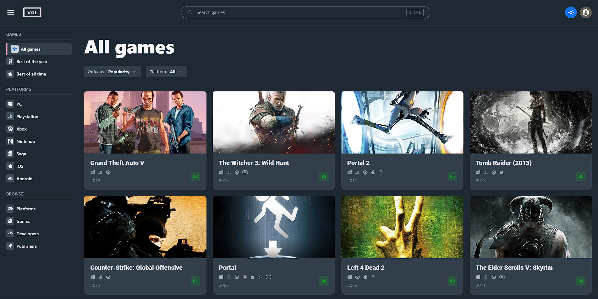

<h1 align="center">
  Video Game Library
</h1>

<h5 align="center">
  A user-friendly web app that provides access to a vast library of video games, with information on everything from the latest releases to classic titles. The app uses   the RAWG API to deliver accurate and up-to-date data.
</h5>


<p align="center">
  
  
  
  
  
  
</p>

## Live demo
🔗 https://vglibrary.web.app

## Running Locally

You'll need Git and Node.js installed on your computer.

```bash
# Clone the repository
git clone https://github.com/m-ler/video-game-library.git

# Move into the repository
cd video-game-library

# Install dependencies
npm install
```

After that, you'll need to create a .env file with the same variables as [`.env.example`](https://github.com/m-ler/video-game-library/blob/main/.env.example).

```bash
# Run project
npm run start
```

## Screenshots

<p align="center">
  </img>
  </img>
</p>

<p align="center">
  </img>
  </img>
  </img>
</p>


